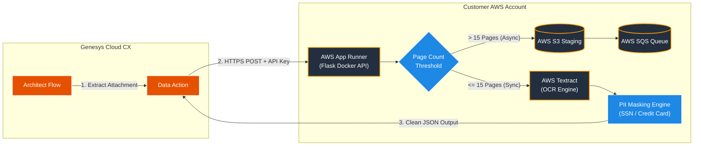

# Genesys Cloud Data Action OCR Blueprint (`genesys-ocr-blueprint`)

[](https://www.npmjs.com/package/genesys-ocr-blueprint)
[](https://opensource.org/licenses/MIT)
[](https://nodejs.org/)

An automated CLI installer and Node.js SDK for deploying a production-ready, automated OCR pipeline for **Genesys Cloud CX**.

This blueprint provisions an isolated, high-performance Python microservice powered by **AWS Textract** directly into **your own AWS account** via Terraform, and automatically imports and publishes the required **Genesys Cloud Data Action** and **Architect Flow** via Archy.

---

## ⚡ Quick Start (1-Command Interactive Deployment)

You can run the interactive installer directly from your terminal using `npx` without needing to install global packages:

```bash
npx genesys-ocr-blueprint deploy

```

The CLI will automatically:

1. Verify system prerequisites (`aws`, `terraform`, `archy`).
2. Collect required credentials interactively.
3. Generate local `terraform.tfvars` configurations.
4. Execute `terraform apply` and deploy your Genesys Cloud resources.

---

## 🏗️ Architecture Overview



### Key Features

* **Multi-Page PDF & Image Support:** Extracts text from multi-page PDFs, JPEGs, and PNGs uploaded during Web Chat, Messaging, or Email interactions.
* **Solving the 15s Timeout Limit:** Small files ($\le 15$ pages) run synchronously in milliseconds. Larger documents are automatically queued to **AWS S3/SQS** for background polling.
* **Automated PII Redaction:** Pre-built regex filters mask Social Security Numbers (SSNs) and Credit Card numbers prior to returning payloads to Genesys Cloud.
* **Zero Third-Party Vendor Lock-in:** Infrastructure runs entirely within your security boundary—no external SaaS fees or third-party data retention.

---

## 📋 Prerequisites

Ensure the following tools are installed and available in your system `PATH` before running the installer:

| Tool | Minimum Version | Installation / Configuration Link |
| --- | --- | --- |
| **Node.js** | `v16.0.0+` | [nodejs.org](https://nodejs.org/) |
| **AWS CLI** | `v2.x` | [AWS CLI Setup Guide](https://docs.aws.amazon.com/cli/latest/userguide/getting-started-install.html) (Run `aws configure`) |
| **Terraform CLI** | `v1.5.0+` | [Download Terraform](https://developer.hashicorp.com/terraform/downloads) |
| **Archy CLI** | Latest | [Genesys Archy Guide](https://www.google.com/search?q=https://developer.genesys.cloud/devapps/archy/) (Run `archy login`) |

### Required Permissions

* **AWS Account:** Rights to manage IAM Roles, S3 Buckets, SQS Queues, and App Runner services.
* **Genesys Cloud Org:** OAuth Client Credentials with `Data Actions > All permissions` and `Architect > Flow > All permissions`.

---

## 💰 Estimated Running Costs

Because this solution uses serverless AWS App Runner and pay-per-use AWS Textract, hosting costs scale directly with usage volume:

| Component | Pricing Model | Estimated Monthly Cost |
| --- | --- | --- |
| **AWS App Runner** | ~$0.007 / vCPU hour (Auto-pauses when idle) | ~$5.00 / month (Low/Medium volume) |
| **AWS Textract** | $1.50 per 1,000 pages processed | $0.0015 / page |
| **AWS S3 & SQS** | Pay-per-request / Free Tier eligible | < $0.50 / month |

---

## 🛠️ Programmatic SDK Usage

You can also import `genesys-ocr-blueprint` as a library into your Node.js DevOps scripts:

```javascript
const { getTerraformDirPath, getArchyFlowPath } = require('genesys-ocr-blueprint');

console.log('Terraform Template Path:', getTerraformDirPath());
console.log('Archy Flow Definition Path:', getArchyFlowPath());

```

---

## 🔧 Manual Deployment Steps

If you prefer to deploy without using the interactive CLI installer:

1. **Clone the Repository:**
```bash
git clone [https://github.com/bhkbdbhatt/genesys-ocr-blueprint.git](https://github.com/bhkbdbhatt/genesys-ocr-blueprint.git)
cd genesys-ocr-blueprint

```


2. **Configure & Deploy Infrastructure:**
```bash
cd templates/terraform
cp terraform.tfvars.example terraform.tfvars
# Fill in terraform.tfvars with your credentials
terraform init
terraform apply -auto-approve

```


3. **Publish Genesys Architect Flow:**
```bash
cd ../archy
archy create --file ocr_flow.yaml

```


---

## ❓ Troubleshooting & FAQs

| Error / Symptom | Likely Cause | Solution |
| --- | --- | --- |
| **`401 Unauthorized` on Data Action execution** | The `X-API-KEY` header in Genesys Data Action does not match `ocr_api_key` in `terraform.tfvars`. | Update the header in Genesys Data Action settings or rerun `terraform apply` with matching keys. |
| **Data Action Timeout (`734` / `REST call timed out`)** | Document exceeds 15 pages and synchronous processing took > 15 seconds. | Ensure async mode is enabled or lower resolution in `app/app.py`. |
| **`400 Bad Request: Failed to download attachment`** | Attachment URL provided by Genesys has expired or requires authentication. | Verify `Message.Message.attachments[0].contentUrl` is passed directly from interaction scope. |
| **App Runner container fails on start** | Missing IAM policy permissions for AWS Textract/S3/SQS. | Verify that `aws_iam_role_policy_attachment` in `terraform/main.tf` has attached the required execution policy. |

---

## 📄 License & Support

* **License:** [MIT License](https://www.google.com/search?q=LICENSE)
* **Issues & Bug Reports:** [GitHub Issues](https://www.google.com/search?q=https://github.com/bhkbdbhatt/genesys-ocr-blueprint/issues)
* **Support:** For technical inquiries or custom integration support, contact `bhk.bdbhatt@gmail.com`.

```

```
